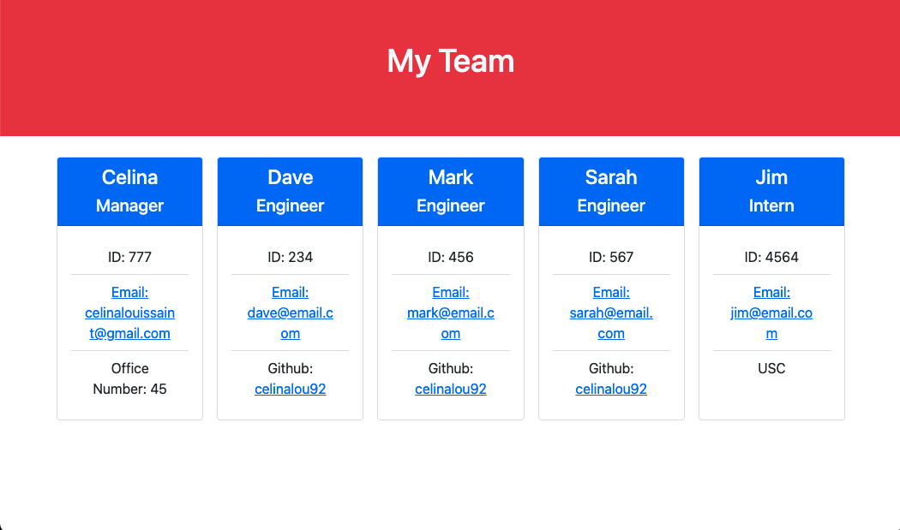

  # Team Profile Generator 
  ## Description 
  An app that will take in a user's input and create a html file with a roster of the team.
  

  ## Tables of Contents
  * [Installation](#installation)
  * [Demo Video](#demo-video-link)
  * [Usage](#usage)
  * [License](#license)
  * [Tests](#tests)
  * [Questions](#questions)
  
  ## Installation 
  npm install/inquirer

  ## Demo Video Link
  https://vimeo.com/541158573

  ## Usage
  This project can be used to create a webpage detailing a team's name role, contact and other relevant information
  
  ## Contributing
  N/A

  ## Tests
  npm run test -- using jest
  ## Questions
  For any questions please reach out to 
  github: [celinalou92](https://github.com/celinalou92)
  email: celinalouissaint@gmail.com

  ## License 
  ### No License
  
